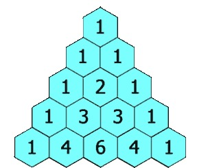

## 题目

给定一个非负整数 numRows，生成杨辉三角的前 numRows 行

<div align="center">  </div>

示例:

```
输入: 5
输出:
[
     [1],
    [1,1],
   [1,2,1],
  [1,3,3,1],
 [1,4,6,4,1]
]
```

## 解答

```num[i][j] = num[i - 1][j - 1] + num[i - 1][j]```

```c++
class Solution {
public:
    vector<vector<int>> generate(int numRows) {
        if(numRows <= 0)    return vector<vector<int>>();
        
        vector<vector<int>> res(1,vector<int>(1,1));
        for(int i = 1;i < numRows;i++){
            vector<int> newline;
            newline.push_back(1);
            for(int j = 1;j < i;j++){
                newline.push_back(res[i - 1][j - 1] + res[i - 1][j]);
            }
            newline.push_back(1);
            res.push_back(newline);
        }
        
        return res;
    }
};
```