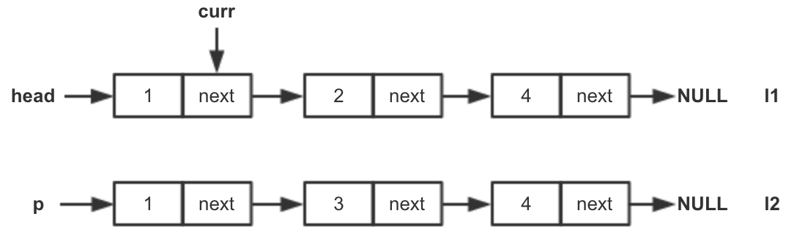
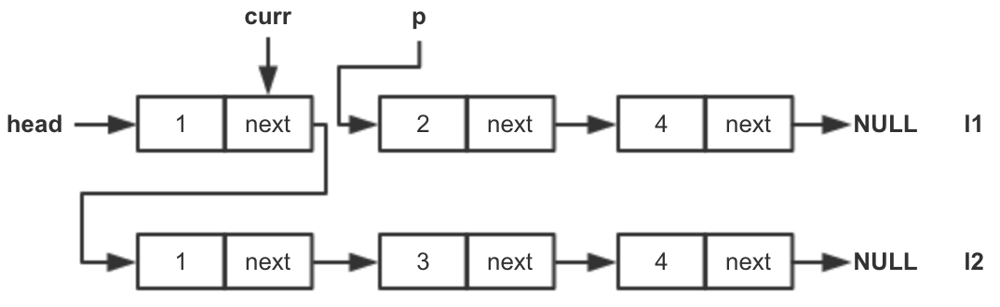

## 思路

首先判断空链表的情况，如果存在一个链表为空，则直接返回另一链表

如果两个链表都不为空，首先获取最终链表的head节点：如果l1的head节点更小，则使用l1的head节点作为最终链表的head节点。否则使用l2的head节点

然后从head节点开始遍历，查找第一个比另一链表“未处理节点中首节点”大的节点，如果没有则会遍历完head节点所在的链表。然后将另一链表“未处理节点中首节点”插入。用一个指针p记录插入前链表剩余部分的首节点。一直重复此步骤直到其中一个链表的“未处理节点”为空（表示这个链表的所有节点已经插入到另一个链表中）:

由于每个节点至多访问一次，所以时间代价为n